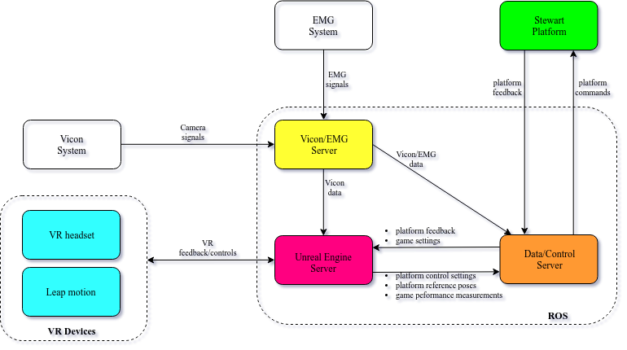

# DORIS
The Dynamic Oriented Rehabilitative Integrated System

**Authors**: Susanna Summa, Riccardo Gori, Luigi Freda, Enrico Castelli and Maurizio Petrarca

This repository will provide part of the C++ implementation behind our paper titled **Development of a dynamic oriented rehabilitative integrated system (DORIS) and preliminary tests**, upon paper acceptance. 

Moving platforms are introduced in the field of the study of posturography since ’70 years. Commercial platforms have some limits: 
* a limited number of Dofs; 
* pre-configured protocols 
* and usually they are expensive.   
In order to overcome these limits, we developed a robotic platform: DORIS. The adopted solution guarantees to be useful for both postural assessment and training of equilibrium and gait. The full control of its movement and of human dynamic interaction is a further benefit for the identification of innovative solutions for research and treatment in a field that is strongly investigated, but still open. DORIS is a Multi Intelligent System provided by the integration of specific modules.

 

### Related publications

Please cite this work if you make use of our system in your projects:
 
**[Development of a dynamic oriented rehabilitative integrated system (DORIS) and preliminary tests]**   
*S. Summa, R. Gori, L. Freda, E. Castelli, M. Petrarca*   
Journal paper, xx, 201x.

----
## License

The **DORIS** stack contains different ROS packages. Each package comes with its own license. Where nothing is specified, a [GPLv3 license](./license/license-gpl.txt) applies to the software.

----
## Contributing to DORIS

We would be very grateful if you would contribute to the code base by reporting bugs, leaving comments and proposing new features through issues and pull requests. Please  feel free to get in touch at *susanna(dot)summa(at)opbg(dot)net*. Thank you!

----
## Funding 

This project is partially supported by Pegaso Onlus (Grant numbers: opbg-201603x003858) and by the Italian Ministry of Health (Grant numbers: CO-2011-02351627). 

----
## Acknowledgments
Mufy (http://www.mufy.it/it/) and Promax (http://www.promax.it/home) provided the technical support in realizing the mechanical structure and for the IT development of the platform control. And GPEM (https://www.gpem.net) helped us  in the integration of the instrumented pole with the motion capture system. Inglobe Technologies (https://www.inglobetechnologies.com) developed the virtual reality that was integrated with the DORIS system. 
